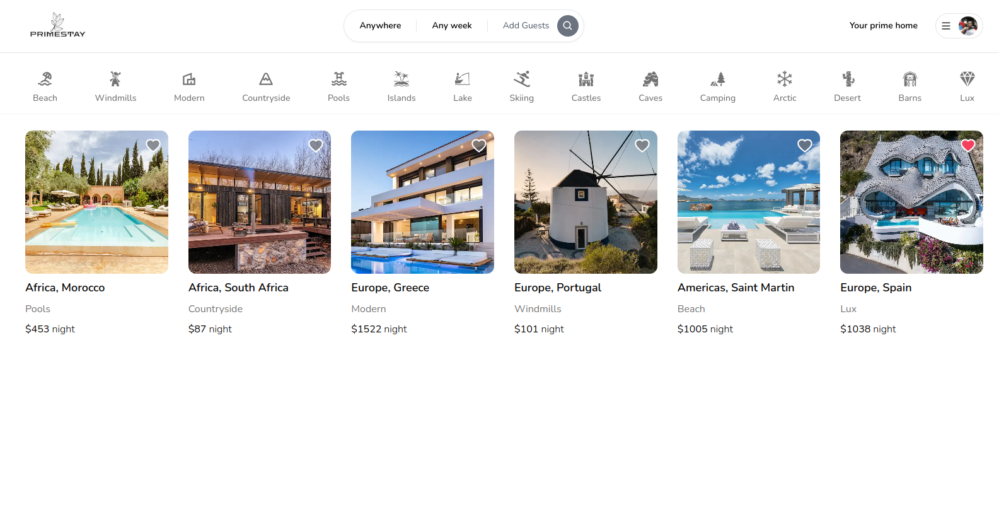

# PrimeStay (A miniature Airbnb clone): Portfolio Project

This application puts special emphasis on the next.js App router, the latest addition to the Next.js framework.

THis Airbnb clone features a seamless navigation and user experience.

This app was built using the latest web develepment technologies including React, Tailwind, Prisma, MongoDB, and NextAuth.

## Examples

Try out the demo here: https://primestay.vercel.app/

## Tech Stack

#### Backend Stack

| Type      | Tech                                                                                                                                                                         |
| --------- | ---------------------------------------------------------------------------------------------------------------------------------------------------------------------------- |
| Language  | [Typescript](https://www.typescriptlang.org/)                                                                                                                                |
| Framework | [NextJs](https://nextjs.org/)                                                                                                                                                |
| Hosting   | [Vercel](https://aws.amazon.com/) (https://vercel.com/)                                                                                                                      |
| Other     | [Prisma](https://www.prisma.io/), [Google Cloud](https://cloud.google.com/), [Github](https://github.com/), [World countries](https://www.npmjs.com/package/world-countries) |

#### Frontend Stack

| Type      | Tech                                                          |
| --------- | ------------------------------------------------------------- |
| Language  | [Typescript](https://www.typescriptlang.org/)                 |
| Framework | [NextJS](https://nextjs.org/) / [React](https://reactjs.org/) |
| Styling   | [TailwindCSS](https://tailwindcss.com/)                       |
| Hosting   | [Vercel](https://vercel.com)                                  |
